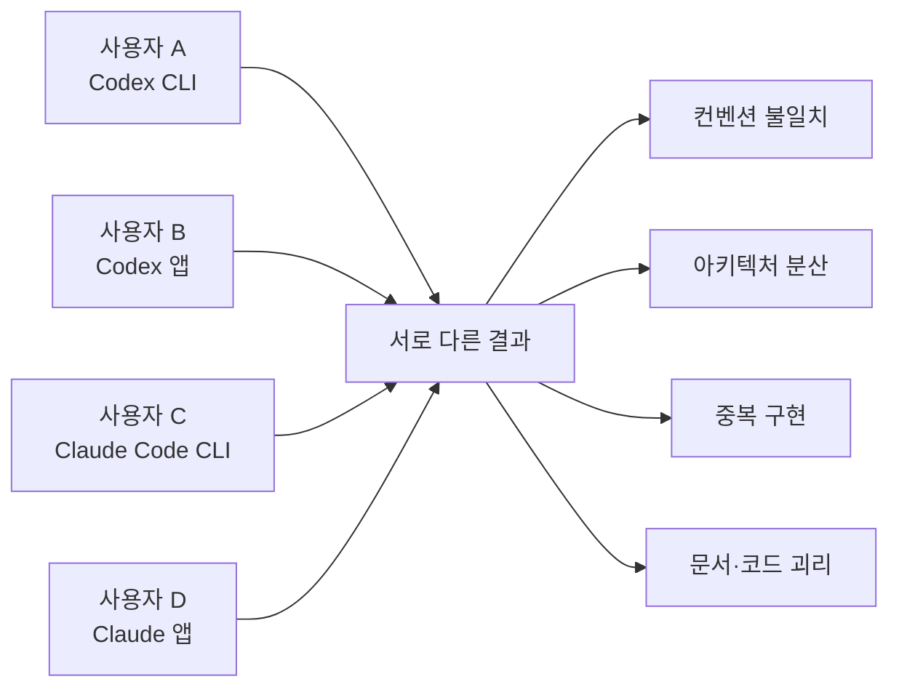
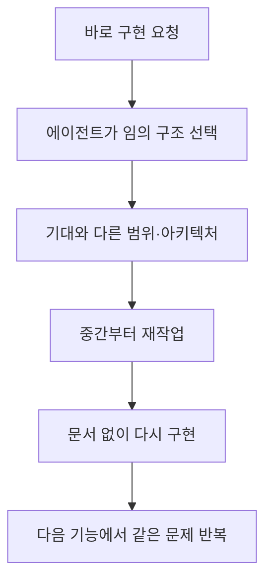
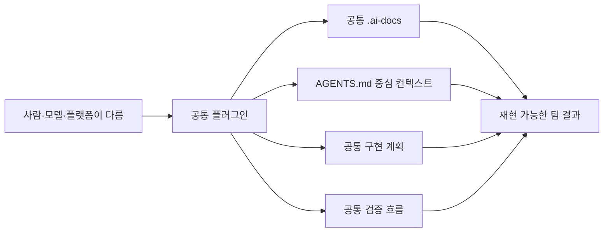
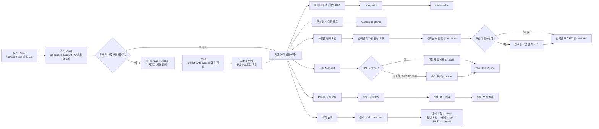
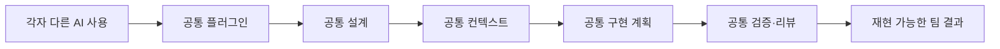

# 왜 플러그인 기반 공통 하네스로 시작하는가

> AI Agent Harness Engineering 소개 문서
> 상세 운영 정본: [Harness Engineering Guide](./Harness_Engineering.md)
> 설치 안내: [Plugin Installation Guide](./Plugin_Installation_Guide.md)

---

## 이 글을 왜 쓰는가

AI를 팀에서 쓰기 시작하면 처음에는 생산성이 크게 올라가는 것처럼 보인다.
그러나 시간이 지나면 다른 문제가 드러난다.

- 어떤 사람은 Codex를 쓴다.
- 어떤 사람은 Claude Code를 쓴다.
- 어떤 사람은 CLI를 쓰고, 어떤 사람은 앱을 쓴다.
- 사람마다 프롬프트와 문서 구조가 다르다.
- 같은 기능인데도 라이브러리, 아키텍처, 에러 처리, 테스트 기준이 달라진다.
- 결과는 남아도 “왜 이렇게 만들었는가”는 남지 않는다.

결국 AI를 썼는데도 코드베이스는 더 빠르게 일관성을 잃을 수 있다.

이 하네스의 목표는 AI를 잘 쓰는 개인 한 명을 만드는 것이 아니다.

> 서로 다른 사람과 서로 다른 모델이 사용해도
> 설계, 컨텍스트, 구현 계획, 검증, 커밋의 기준이 크게 흔들리지 않는
> 공통 작업 체계를 만드는 것.

실제 프로젝트는 `harness-kit` 플러그인을 설치해서 같은 흐름을 사용한다. 프로젝트 저장소는 사용자 스킬 복사본을 배포하지 않는다. 사용자는 프로젝트 결과물에 집중하고, 관리자는 스킬과 배포 품질을 한곳에서 관리한다.

---

# 제1부. 사용자용 — 실제 프로젝트에서 하네스를 쓰는 이유와 방법

## 1. 우리가 해결하려는 문제

### 문제 1. 사람마다 AI 사용 방식이 다르다

같은 요구사항을 주어도 사용 도구와 개인 습관에 따라 결과가 달라진다.



하네스는 모델의 답을 완전히 같게 만들지는 않는다. 대신 어떤 문서를 먼저 만들고, 무엇을 입력으로 쓰고, 언제 검증하는지를 같게 만든다.

### 문제 2. AI는 프로젝트 맥락을 계속 기억하지 못한다

에이전트는 현재 task/session에 들어온 파일과 대화, 접근 가능한 코드로 판단한다.
팀 규칙이 문서로 고정되지 않으면 새 session마다 다시 설명해야 하고, 설명이 누락되면 에이전트가 임의의 기준을 선택한다.

그래서 하네스는 다음을 프로젝트에 남긴다.

- 단일 앱의 루트 `AGENTS.md`, 복수 앱의 `.ai-docs/root-context/AGENTS.md` 형상관리 원본과 루트 실행용 `AGENTS.md`
- Codex와 Claude Code 2.1.277 이상이 직접 읽는 `AGENTS.md` 단일 진입점
- 설계 문서
- 주제별 instruction
- 구현 계획과 roadmap index
- 검증 근거

### 문제 3. “바로 구현”은 빠른 것 같지만 자주 더 느리다



짧은 설계와 작은 Phase가 오히려 재작업을 줄인다.

### 문제 4. 좋은 결과를 재현하기 어렵다

좋은 결과가 나와도 그것이 특정 사람의 경험, 모델의 우연한 판단, 프롬프트, 문서 구조 중 무엇 때문인지 구분하기 어렵다. 작업 순서와 산출물이 고정돼야 다음 사람도 같은 품질 기준을 재현할 수 있다.

## 2. 그래서 무엇을 고정하는가

하네스는 “좋은 프롬프트 몇 줄”을 모은 것이 아니다. 다음을 고정한다.

1. 프로젝트를 시작하는 문서 골격
2. 요구사항을 설계로 만드는 형식
3. 에이전트가 계속 읽을 컨텍스트
4. 단일 기능과 FE/BE·다중 화면을 나누는 구현 계획
5. Phase 시작 전 재사용 점검 계약
6. 구현 후 검증·리뷰·문서 감사 계약
7. 최종 변경 상태의 커밋 전 검사
8. 명시 요청 시 Markdown 산출물의 승인형 문체 개선



## 3. 핵심 철학

### 3.1 설계가 먼저다

코드를 쓰기 전에 무엇을 만들고, 왜 만들며, 어디까지가 이번 범위인지 정리한다. 작은 작업이라면 설계도 짧아질 수 있지만, 설계 없이 범위를 에이전트에게 넘기지는 않는다.

### 3.2 고정 맥락은 얇고 연결 가능해야 한다

루트 `AGENTS.md`는 프로젝트·앱 경계와 문서 읽기 순서를 안내하는 지도로 유지한다. 복수 앱은 `.ai-docs/root-context/AGENTS.md`를 형상관리 갱신 기준으로 두고 루트 `AGENTS.md`를 실행용으로 갱신한다. 앱의 상세 현재 사실은 DESIGN과 양방향 추적하는 `.ai-docs/{앱}-context.md`, 세부 규칙은 `.ai-docs/**/instruction/`으로 분리한다. Claude 대상 setup은 프로젝트부터 파일시스템 루트까지 선점하는 `CLAUDE.md`, `.claude/CLAUDE.md`, `CLAUDE.local.md`가 없는지 먼저 확인한다.

### 3.3 구현은 작은 단위로 쪼갠다

한 번에 프로젝트 전체를 바꾸지 않는다. Phase, 화면, 기능, 모듈, 태스크로 끊고 각 단위 끝에서 사람이 확인할 결과와 검증을 둔다.

### 3.4 문서와 코드는 함께 움직인다

설계 결정이 바뀌면 문서도 바뀌어야 한다. 코드가 문서와 다를 때는 코드를 설계에 맞추거나, 바뀐 결정을 문서에 반영한다. 낡은 문서를 그대로 두지 않는다.

### 3.5 품질 확인을 앞당긴다

모든 기능을 만든 뒤 한 번에 검증하지 않는다. Phase마다 필요한 재사용 후보를 보고,
구현이 끝나면 계획 대비 결과를 확인하고, 필요한 리뷰와 커밋 전 검사를 수행한다. 이때
특정 스킬 이름보다 evidence의 내용과 신뢰성을 기준으로 삼는다.

### 3.6 문서 문체도 구조 계약을 해치지 않게 개선한다

AI가 만든 Markdown은 구조는 맞아도 문장이 기계적일 수 있다. 사용자가 문체 개선을
명시적으로 요청한 경우에만 producer 뒤에 `humanize-korean` 개선안을 연결한다. 자동으로
덮어쓰지 않고 diff를 먼저 보여 주며 승인 후 원 producer가 구조를 다시 검증한다.

### 3.7 스킬 배포는 프로젝트 책임이 아니다

`harness-setup`은 Harness Kit 사용자 스킬 복사본을 `.agents/skills`, `.claude/skills`,
`skills/`에 만들거나 맞추지 않는다. 이 규칙은 Harness Kit의 배포 위치를 뜻하며 다른
설치 스킬·플러그인·일반 Agent의 사용을 금지하지 않는다. 프로젝트에서 발견한 고유
custom skill과 사용자 스킬 복사본은 읽기 전용으로 분류·보고하고 승인 없이 변경하지 않는다.

## 4. 스킬 역할 소개

### 설치·기반

| 스킬 | 역할 | 언제 쓰는가 |
|------|------|-------------|
| `harness-setup` | `.ai-docs` 골격, `AGENTS.md` 정본과 `.ai-docs/harness/` portable routing bundle 생성·복구; Claude instruction 선점 검사; 별도 승인 시 Claude·Codex write guard 설치 | 모든 참여자가 자기 작업 환경에서 최초 1회. 서명 정책 활성 뒤 공유 루트·하네스 갱신은 `admin`이 수행 |
| `harness-bootstrap` | 기존 코드를 스캔해 설계·컨텍스트 역추출 | 하네스 문서가 없는 기존 코드 |
| `git-scoped-account` | 단일·복수 repo의 Git 작성자와 provider·host·login을 프로젝트 범위로 지정하고 정책이 있으면 현재 PC를 로컬 등록 | 모든 참여자가 PC별 최초 1회, 새 PC·새 clone·계정·repo 변경 때 |
| `project-write-access` | `.ai-docs`와 Git에 포함된 루트 컨텍스트의 공유 역할 정책, CODEOWNERS와 PC별 Git·AI 가드를 연결 | 관리자는 공유 정책 설정·변경, 각 참여자는 PC별 로컬 등록 |

단일·복수 repo의 모든 참여자는 `git-scoped-account`를 자기 PC에서 최초 1회 명시 호출한다. 공통 config의 `user.name`·`user.email` 출처와 provider·host·login 표식을 확인한다.

`project-write-access`는 선택 기능이다. 권한을 사용하는 프로젝트는 원격 Git provider·저장소·참여자 계정을 준비하고, 관리자가 `harness-setup`과 참여자별 Git 계정 등록 뒤 `design-doc`, `context-doc`, 앱 핵심 문서를 만드는 `harness-bootstrap`보다 먼저 공유 정책을 설정한다. 정책 생성 뒤 각 참여자는 관리자 키 없이 자기 PC의 로컬 Git·AI 가드만 등록한다. `admin`은 앱 문서 권한을 상속하지 않으며, 권한이 있는 `pm-pl`·`app-doc-lead`도 앱 핵심 문서를 AI로 쓰기 전에 대상·문서 역할·변경 이유를 설명받고 한 번 더 확인한다. 정책이 있는데 현재 PC의 Git 계정 표식이나 로컬 등록이 없거나 서로 다르면 지원되는 AI 가드는 `.ai-docs/**` 쓰기를 거부하지만 애플리케이션 소스코드는 막지 않는다.

`harness-setup`이 만든 portable bundle은 플러그인 제거 뒤에도 남는다. 공유 파일은 프로젝트 상대경로만 사용하고, host hook의 `pending-trust`/`active` 상태는 Git에서 제외되는 `.ai-docs/.harness/routing-state.local.json`에 PC별로 기록한다. 외부 fixed-format 산출물은 `_inbox`에서 basename·hash만 관리해 원본 PC 경로를 공유하지 않는다. `_inbox` 파일은 기본적으로 로컬에서만 보관하지만, 설계·instruction에 계속 참고할 원문은 사용자가 정확한 파일과 Git 공유를 명시한 경우에만 파일별로 선택 추적할 수 있다. 추적된 원문도 정규 산출물로 자동 승격되지 않으며 commit과 원격 push는 각각 별도로 요청해야 한다.

### 설계·컨텍스트·프로토타입

| 스킬 | 역할 | 언제 쓰는가 |
|------|------|-------------|
| `design-doc` | 프로젝트 전체는 확장 가능한 앱 기준 문서로, 상세 단위는 구조화한 설계로 변환 | 신규 프로젝트·기능 설계. 기술 스택 기반 아키텍처 후보와 구조 예시를 확인하며, 권한 정책이 있으면 허용된 역할·앱 범위에서 실행 |
| `context-doc` | DESIGN과 현재 앱 자료를 1~10 상세 컨텍스트와 주제별 instruction으로 변환 | 에이전트가 계속 읽을 기준이 필요할 때. 권한 정책이 있으면 `design-doc`과 같은 범위에서 실행하며 루트 지도 변경은 `harness-setup` 후속 작업으로 남김 |
| `ui-ux-pro-max` | 디자인 방향·색·타이포그래피·레이아웃·접근성 결정 | 화면의 디자인 기준을 정하거나 기존 UI를 점검할 때 |
| `motion-design` | 모션 목적·타이밍·이징·reduced-motion 대안 결정 | 전환·상태 피드백·등장 순서에 움직임이 필요할 때 |
| `design-prototype-docs` | 화면 요구사항·배치·이동 흐름 문서화 | 화면을 먼저 합의할 때 |
| `create-prototype` | 단일 `.ai-docs/prototype/`, 복수 `.ai-docs/{앱}/prototype/` 아래 검증 시안 생성 | 고객 확인·UX 검증용 시안 |
| `frontend-design` | 실제 제품 UI 구현 품질 기준 적용 | 앱의 페이지·컴포넌트·스타일 구현 |

모든 producer는 단일 앱의 `@.ai-docs/instruction/artifact-output-routing-instruction.md` 또는 복수 앱의 `@.ai-docs/{앱}/instruction/artifact-output-routing-instruction.md`를 기준으로 산출물 위치·소유권·인계를 결정한다. `create-prototype`은 이 계약에 따라 검증 시안을 만들고 `frontend-design`은 승인된 앱 소스에 실제 제품 UI를 구현한다.

### 구현 계획·점검

| 스킬 | 역할 | 언제 쓰는가 |
|------|------|-------------|
| `impl-doc` | 단일·소규모 기능의 Phase별 구현 계획 | 단일 BE/FE 기능, CLI, 모듈, 스크립트 |
| `impl-fe-be-doc` | FE/BE 페어 또는 다중 화면 구현 계획 | 풀스택 다중 기능, RFP/SFR 화면군 |
| `impl-reuse-scan` | 기존 공통 자산 후보 보고 | Phase·태스크 시작 직전 |
| `impl-verify` | 계획 대비 PASS/FAIL/SKIP 검증 | Phase·태스크 구현 직후 |

단일 FE 화면이나 단일 BE API라는 이유만으로 `impl-fe-be-doc`을 고르지 않는다. 분기 기준은 **단일 작업인가, 다중 화면 또는 페어 다중 기능인가**다.

### 품질·운영

| 스킬 | 역할 | 언제 쓰는가 |
|------|------|-------------|
| `multi-review` | 보안·성능·유지보수·테스트 4관점 리뷰 | 구현·검증 직후 |
| `doc-audit` | 코드와 프로젝트 문서의 괴리 분석 | 구조나 동작이 바뀌었을 때 |
| `code-comment` | 필요한 변경 코드의 한글 주석 보강 | 인수인계 맥락이 코드만으로 부족할 때 |
| `commit` | 범위·diff·검증을 확인하고 의도한 파일만 stage해 정상 hook과 Conventional Commit을 실행한 뒤 사후 증거 확인 | 사용자가 커밋을 명시 요청할 때 |
| `humanize-korean` | 한국어 Markdown 개선안과 diff | 사용자가 문체 개선을 명시 요청했을 때 |

RFP는 `design-doc`, `design-prototype-docs`, 다중 화면·FE/BE 페어 계획용 `impl-fe-be-doc`에 직접 입력한다. 사용자 스킬 배포·업데이트는 플러그인이 담당한다.

프로젝트 문서 루트는 `.ai-docs/`다. `.docs/` 디렉토리가 존재해도 참조하지 않고 일반 디렉토리로 취급한다.

## 5. 언제 어떤 스킬을 쓰는가



빠른 선택:

- 모든 참여자의 작업 환경에서 프로젝트 문서 골격을 처음 확인한다 → `harness-setup` 1회
- 단일·복수 repo에서 Git 작성자·provider 계정을 맞춘다 → 모든 참여자가 `git-scoped-account` 1회
- 문서 쓰기 권한을 나눈다 → 관리자 공유 정책 설정 뒤 모든 참여자가 PC별 로컬 등록
- 문서 없는 기존 코드다 → `harness-bootstrap`
- 요구사항이나 RFP를 설계로 정리한다 → `design-doc`
- 설계를 에이전트 규칙으로 고정한다 → `context-doc`
- 화면부터 본다 → 필요에 맞는 디자인·명세·프로토타입 producer를 선택한다
- 단일 기능 계획을 만든다 → 선택지: `impl-doc`
- 다중 화면·FE/BE 페어 계획을 만든다 → 선택지: `impl-fe-be-doc`
- 구현을 시작한다 → 재사용 검토. 선택지: `impl-reuse-scan`
- Phase가 끝났다 → 계획 대비 검증. 선택지: `impl-verify`
- 커밋을 준비한다 → 리뷰·문서 감사·재검증 뒤 사용자가 `commit` 명시 호출

## 6. 전체 사용자 흐름

### 신규·요구사항 기반

```text
플러그인 설치
→ 새 task/session
→ 모든 참여자: 자기 작업 환경에서 harness-setup 최초 1회
→ 단일·복수 repo: 모든 참여자가 자기 PC에서 git-scoped-account 최초 1회
→ 문서 권한을 분리하면 원격 provider·저장소·참여자 계정 준비
→ 관리자: project-write-access 공유 정책 설정
→ 모든 참여자: 현재 PC 로컬 등록
→ 권한 정책이 있으면 허용된 역할·앱 범위에서 design-doc
→ 같은 역할·앱 범위에서 context-doc
→ 화면 작업일 때 선택: 디자인·명세·프로토타입 producer
→ 선택: 구현 계획 producer
→ 선택: 재사용 검토
→ Phase·태스크 단위 구현
   └─ 제품 UI 작업이면 승인된 source에 맞는 구현 도구 선택
→ 선택: 구현 검증
→ 선택: 코드 리뷰
→ 선택: 문서 감사
→ 필요한 수정·재검증
→ 선택: code-comment
→ 사용자 명시 요청: commit
  └─ 지침·status·diff·최근 log → 의도한 파일만 stage → 정상 hook → 사후 증거
```

### 문서 없는 기존 코드

```text
플러그인 설치
→ 새 task/session
→ 모든 참여자: 자기 작업 환경에서 harness-setup 최초 1회
→ 단일·복수 repo: 모든 참여자가 자기 PC에서 git-scoped-account 최초 1회
→ 문서 권한을 분리하면 원격 provider·저장소·참여자 계정 준비
→ 관리자: project-write-access 공유 정책 설정
→ 모든 참여자: 현재 PC 로컬 등록
→ harness-bootstrap
   ├─ 기존 harness-setup 골격 확인
   ├─ 코드 스캔
   ├─ design-doc 형식 설계
   └─ context-doc 형식 컨텍스트
→ 선택: 구현 계획 producer
→ 이후 흐름은 동일
```

`harness-bootstrap`은 문서 없는 기존 코드를 설계·컨텍스트로 역추출하는 진입점이다. 권한 정책이 활성화된 프로젝트에서는 내부의 설계·컨텍스트 쓰기도 현재 역할과 앱 범위를 따른다. 이후 설계나 컨텍스트가 바뀌면 전체 코드를 다시 스캔하기보다 `design-doc`과 `context-doc`을 갱신한다.

### Markdown 문서 개선이 끼어드는 위치

여기서 producer는 Markdown 파일이나 문서 묶음을 생성·갱신하고 저장 경로와 구조를
검증한 뒤 다음 단계로 넘기는 산출물 책임 주체를 뜻한다. 사용자가 문체 개선을 명시적으로
요청한 경우에만 아래 순서를 거친다. Harness Kit의 producer 목록은 선택지이며 다른 설치
스킬·플러그인·일반 Agent를 배제하지 않는다.

```text
원 producer 구조 검증
→ 최외곽 owner가 bundle당 한 번 개선안·diff 제안
→ 사용자 승인·건너뛰기·거절
→ 승인된 변경만 반영
→ 원 producer 구조 재검증
→ 최종 Markdown을 downstream에 전달
```

상태와 내용 fingerprint는 `.ai-docs/.harness/humanize-handoffs.json`에 기록해 새 session에서도 같은 제안을 반복하지 않는다. 개선을 건너뛰어도 작업은 계속된다.

## 7. 시작하는 방법

### 7.1 먼저 플러그인을 설치한다

프로젝트 옆에 이 관리 저장소를 clone하지 않는다. 설치와 업데이트는 플랫폼의 plugin marketplace를 사용한다. 자세한 명령은 [Plugin Installation Guide](./Plugin_Installation_Guide.md)를 따른다.

### 7.2 플랫폼 문법으로 스킬을 명시 호출한다

Codex:

```text
$harness-setup
$design-doc
$impl-doc
$impl-verify
```

Claude Code:

```text
/harness-kit:harness-setup
/harness-kit:design-doc
/harness-kit:impl-doc
/harness-kit:impl-verify
```

파일 첨부와 경로 참조 문법은 플랫폼 인터페이스에 따라 다를 수 있다. 중요한 것은 호출 문자를 억지로 통일하는 것이 아니라 다음 네 가지를 요청에 함께 넣는 것이다.

- 어떤 스킬을 사용할지
- 무엇을 참고할지
- 이번 턴의 범위가 어디까지인지
- 무엇을 건드리면 안 되고 완료 기준이 무엇인지

### 7.3 새 session에는 최소 컨텍스트를 다시 준다

새 task/session을 열 때는 다음을 우선 제공한다.

1. 루트 `AGENTS.md`
2. 대상 앱의 context와 instruction
3. 현재 설계 문서
4. 현재 구현 계획과 정확한 Phase·태스크 ID
5. 수정 금지 범위와 검증 기준

## 8. 실전 프롬프트 예시

아래 예시는 Codex 문법을 사용한다. Claude에서는 `$skill-name`을 `/harness-kit:skill-name`으로 바꾼다.

### 예시 1. 아이디어에서 설계 문서로

```text
$design-doc

운영자가 문서를 업로드한 뒤 AI 요약과 태깅 결과를 검수하는 기능을 설계해줘.
기존 운영 포털 안의 기능이며 React + Spring Boot + PostgreSQL을 유지한다.
관련 모듈은 admin/documents, shared/upload, shared/ai-client다.
업로드 상태 추적, 실패 재시도, 권한 확인을 포함해 인터뷰해줘.
초안을 먼저 보여 주고 승인 전에는 파일로 저장하지 말아줘.
```

### 예시 2. RFP에서 특정 요구사항을 직접 설계

```text
$design-doc

첨부한 제안요청서에서 SFR-019만 범위로 사용해줘.
화면 후보, 주요 액션, 입력·출력, 예외 케이스를 정리하고
문서에 없는 내용은 추정으로 구분해줘.
모호한 점은 한 번에 최대 5개만 질문해줘.
```

RFP는 이 producer에 직접 입력한다.

### 예시 3. 기존 코드에 하네스 도입

```text
$harness-bootstrap

현재 repository가 대상 프로젝트다.
코드에서 직접 관찰한 사실과 내가 확인해야 할 추정을 분리해줘.
기존 실행 명령과 테스트 체계를 우선하고 새 표준을 임의로 만들지 말아줘.
생성 예정인 .ai-docs와 AGENTS.md 전체를 저장 전에 보여줘.
```

### 예시 4. 설계를 에이전트 규칙으로 고정

```text
$context-doc

.ai-docs/context-base/DESIGN.md를 입력으로 사용해줘.
{앱}-context.md에는 DESIGN 링크와 양방향 최신화 원칙, 1~10 상세 현재 사실과
루트 컨텍스트 → 앱 컨텍스트 → 필요한 instruction 필독 순서를 남기고,
7번에는 핵심 도메인 개념을 포함한 계층형 앱 특이사항을, 10번에는 DESIGN.md 02와
같은 노드·Depth의 구축 대상 기능 분류를 두고,
아키텍처·코드 스타일·API 규칙은 instruction으로 분리해줘.
최초 instruction은 제목과 보편 목적만 있는 골격으로 만들고, 이후 현재 확정 규칙만
반영해줘. 더 이상 필요 없는 선택 instruction은 삭제 후보로 보여준 뒤 승인받아
9번 인덱스와 함께 제거하고, 모든 본문에는 변경 이력을 남기지 마.
금지 규칙은 패턴, 이유, 대안을 함께 적어줘.
루트 AGENTS.md는 수정하지 말아줘.
```

### 예시 5. 화면을 먼저 확인

```text
$design-prototype-docs

.ai-docs/context-base/DESIGN.md를 기준으로
관리자 대시보드, 작업 목록, 상세 패널의 화면 경계를 정리해줘.
기능 배치 이유와 화면 간 이동 흐름을 포함하고
저장 전 디자인 문서를 먼저 보여줘.
```

승인된 화면 설계 문서를 입력으로 프로토타입 producer를 선택한다. `$create-prototype`은 제공 선택지다.

### 예시 6. 구현 계획 선택

단일 BE 기능:

```text
$impl-doc

.ai-docs/context-base/DESIGN.md의 검색 API 기능만 계획해줘.
엔드포인트 2개와 단일 검색 도메인 로직이 범위다.
다른 화면과 배포 설정은 제외하고 Phase마다 자동 검증 명령을 적어줘.
```

다중 화면·FE/BE 페어:

```text
$impl-fe-be-doc

첨부한 SFR-021의 목록, 상세, 승인 화면과 연결 API를 함께 계획해줘.
한 Phase가 화면 하나와 필요한 FE·API·BE 검증까지 끝내도록 나눠줘.
공통 선행 요소는 별도 Phase로 분리해줘.
```

### 예시 7. Phase 하나만 구현

```text
.ai-docs/impl-doc/developer/260730-1.search-impl-api.md를 참고해줘.

Phase 2의 API-03만 구현해줘.
수정 범위는 search controller, service, 관련 test로 제한한다.
인증 공통 모듈과 다른 Phase는 변경하지 말 것.
완료 후 수정 파일, 실행한 검증, 남아 있는 위험을 보고해줘.
```

필요하면 Phase 시작 전에 재사용 검토, 완료 후 계획 대비 검증을 수행한다.
`$impl-reuse-scan`과 `$impl-verify`는 사용할 수 있는 선택지이며 필수 호출이 아니다.

### 예시 8. 커밋 전 품질 확인

```text
$multi-review
현재 변경 파일에서 보안, 성능, 테스트 누락을 우선순위 높게 봐줘.

$doc-audit
변경된 동작과 AGENTS.md, .ai-docs 문서가 어긋나는지 분석만 해줘.
승인 전에는 문서를 수정하지 말아줘.
```

필요한 코드 주석을 승인해 반영했다면 마지막 변경 상태를 재검증한 뒤 범위를 적어 `$commit <범위>` 또는 `/harness-kit:commit <범위>`를 명시 호출한다.
`commit`은 기존·범위 밖 staged 변경을 보존하며, message-only 요청은 index, worktree, HEAD를 바꾸지 않는다. 리뷰에서 commit으로 자동 handoff하지 않는다.

## 9. 권장 사용 습관

### 9.1 한 번에 너무 큰 범위를 시키지 않는다

나쁜 예:

```text
로그인, 회원가입, 관리자 대시보드, API 연동, 배포까지 전부 만들어줘.
```

좋은 예:

```text
구현 계획의 Phase 1, BE-02와 FE-02만 진행해줘.
공통 레이아웃과 다른 Phase는 변경하지 말 것.
```

### 9.2 참조 문서를 먼저 정한다

안정적인 결과는 보통 다음 문서에서 나온다.

- 설계 문서
- `AGENTS.md`
- 대상 앱 context
- `.ai-docs/**/instruction/*-instruction.md`
- 현재 구현 계획
- 직접 관련된 RFP·요구사항

많이 첨부하는 것보다 이번 범위에 필요한 문서를 정확히 고르는 편이 낫다.

### 9.3 금지 범위와 완료 기준을 함께 적는다

단순히 “구현해줘”보다 다음이 명확하다.

```text
수정 허용: controller, service, 해당 test
수정 금지: 인증 공통 모듈, DB schema, 다른 Phase
완료 기준: unit test와 API contract test 통과
보고: 수정 파일, 실행한 명령, 남은 위험
```

### 9.4 검증 실패를 다음 Phase로 넘기지 않는다

선택한 검증 도구의 FAIL은 다음 Phase 차단을 권고하는 신호다. 실패를 고치거나, 정말
허용할 이유와 후속 작업을 명시한다.

### 9.5 문서 갱신을 미루지 않는다

구조가 바뀌었는데 `AGENTS.md`나 설계가 예전 상태면 다음 에이전트가 낡은 규칙을 믿는다. `doc-audit`으로 괴리를 찾고, 승인한 변경을 해당 producer로 갱신한다.

### 9.6 새 session은 실패가 아니라 도구다

대화가 길어져 범위가 섞이면 새 session을 열고 현재 설계, 구현 계획, 태스크 ID를 다시 준다. 오래된 대화 전체를 끌고 가는 것보다 고정 문서에서 문맥을 복원하는 편이 안정적이다.

## 9.7 화면을 만들 때 쓰는 별도 흐름

화면이 있는 작업에는 디자인 전용 흐름이 따로 있다. 백엔드 작업에는 쓰지 않는다.

**`ui-ux-pro-max`** — 화면의 색, 글꼴, 배치, 사용 편의성을 정할 때 쓴다. 안에는 제품 종류별·업종별 디자인 자료가 담긴 검색 가능한 자료실이 들어 있다. "감으로 정하지 말고 근거를 찾아보자"에 가깝다.

**`motion-design`** — 화면이 왜 움직이는지, 얼마나 빠르게, 어떤 순서로 움직이는지 정할 때 쓴다.

호출은 다른 스킬과 같다. Codex는 `$ui-ux-pro-max`, Claude Code는 `/harness-kit:motion-design` 형식이다. 둘 다 기본은 대화창으로 결과를 알려주는 것이고, 파일은 사용자가 만들라고 해야 만든다.

파일 저장을 요청하면 담당 스킬과 대상 앱에 따라 위치를 나눈다.

| 담당 스킬 | 단일 앱 | 복수 앱 |
|---|---|---|
| `ui-ux-pro-max` | `.ai-docs/design-system/{project-slug}/MASTER.md`, `.ai-docs/design-system/{project-slug}/pages/{page-slug}.md` | `.ai-docs/{앱}/design-system/{project-slug}/MASTER.md`, `.ai-docs/{앱}/design-system/{project-slug}/pages/{page-slug}.md` |
| `motion-design` | `.ai-docs/design-system/{project-slug}/motion/{screen-or-component}.md` | `.ai-docs/{앱}/design-system/{project-slug}/motion/{screen-or-component}.md` |

### 프로토타입과 실제 화면은 다르다

**프로토타입은 버려도 되는 시험 화면이다.** 요구사항이 맞는지, 화면 구성이 쓸 만한지 빨리 확인하려고 만든다. 확인이 끝나면 역할이 끝난다.

**실제 화면은 제품 소스에 들어가서 계속 유지되는 화면이다.** 기존 컴포넌트를 쓰고, 기존 상태 관리와 연결되고, 테스트와 배포를 거친다.

프로토타입 코드를 그대로 제품에 넣지 않는 이유는 **만든 목적이 다르기** 때문이다. 프로토타입은 빨리 보여주려고 지름길을 많이 쓴다. 데이터를 화면에 직접 박아 넣고, 기존 컴포넌트를 무시하고 새로 그리고, 예외 처리를 생략한다. 그걸 제품에 넣으면 그 지름길이 전부 갚아야 할 빚이 된다.

그래서 프로토타입에서 넘어갈 때는 **코드가 아니라 결정을 넘긴다.** "이 색과 이 배치로 가기로 했다"를 넘기고, 구현은 제품 구조에 맞게 다시 한다.

### 모션을 항상 넣지 않는 이유

움직임은 공짜가 아니다. 사용자의 주의를 가져가고, 기다리게 만들고, 어떤 사람에게는 어지러움을 유발한다. 그래서 이 하네스는 모션을 넣기 전에 **왜 필요한지 먼저 묻는다.**

정보를 전달하거나, 상태가 바뀐 걸 알리거나, 어디서 열렸는지 보여주거나, 눌렸다는 걸 알려주는 목적이 없으면 넣지 않는다. 특히 공공·의료·금융 화면은 조용한 쪽이 기본이다. 급한 일을 처리하러 온 사람에게 화려한 화면은 방해다.

`prefers-reduced-motion`을 켠 사용자에게는 대체 수단이 반드시 있어야 한다. 애니메이션만 꺼서는 안 되고, 그 움직임이 전달하던 정보를 **다른 방법으로** 전달해야 한다.

### Caveman과 Ruflo가 여기 없는 이유

가끔 함께 언급되는 두 도구가 있다.

[Caveman](https://github.com/JuliusBrussee/caveman)은 AI가 말을 짧게 하도록 바꾸는 도구다. 토큰을 아끼는 게 목적이라 이 하네스가 하려는 "설계와 검증을 문서로 남기기"와 방향이 다르다.

[Ruflo](https://github.com/ruvnet/ruflo)는 그 자체로 완결된 큰 하네스다. 여러 에이전트, 메모리, 도구 연결을 모두 갖고 있다. 이걸 조금만 떼어다 넣으면 원본의 장점은 사라지고 유지보수 부담만 남는다.

둘 다 좋은 도구지만 **필요하면 원본 그대로 따로 설치해서 쓰는 편이 낫다.** 설치 방법은 각 저장소 안내를 따른다.

## 10. 추천하는 최초 도입 순서

관리 저장소의 사용자 스킬 정본과 현재 stable `0.6.0` runtime은 모두 20종이다. `project-write-access`도 이 runtime에 포함되지만 권한을 쓰지 않는 프로젝트에서는 호출하지 않는다. 프로젝트 수행자가 모든 스킬을 한꺼번에 사용할 필요는 없다.

### 0단계 — 설치와 문서 골격

- 플러그인 설치
- 새 task/session
- 모든 참여자가 자기 작업 환경에서 `harness-setup` 최초 1회
- 단일·복수 repo의 모든 참여자가 `git-scoped-account` PC별 최초 1회
- 문서 권한을 나누면 원격 provider 준비 → 관리자 공유 정책 설정 → 모든 참여자 PC별 로컬 등록
- local user skill directory 미생성 확인

### 1단계 — 최소 하네스

- 신규·요구사항 기반: 권한 정책이 있으면 허용된 역할·앱 범위에서 `design-doc` → `context-doc`
- 하네스 문서 없는 기존 코드: 같은 권한 범위에서 `harness-bootstrap`

여기까지가 기반 흐름이다. 이후 항목은 프로젝트와 사용자가 고르는 제공 선택지다.

### 2단계 — 선택형 구현 전후 품질

- `impl-doc` 또는 `impl-fe-be-doc`
- `impl-reuse-scan`
- `impl-verify`
- `multi-review`
- `doc-audit`
- `commit`

### 3단계 — 화면·문서 품질 확장

- `ui-ux-pro-max`
- `design-prototype-docs`
- 필요 시 `motion-design`
- `create-prototype`
- `frontend-design`
- 명시 요청 시 `humanize-korean` 승인 흐름

반복 업무를 새 스킬로 만드는 단계는 사용자 프로젝트에서 수행하지 않는다. 사례를 모아 하네스 관리자에게 개선 후보로 전달한다.

## 11. 팀 관점에서 얻는 효과



기대 효과:

- 모델과 실행 환경이 달라도 작업 순서가 유지된다.
- 신규 인원이 프로젝트 문맥을 빠르게 복원한다.
- 왜 그렇게 구현했는지가 설계와 계획에 남는다.
- 중복 구현을 시작 전에 발견한다.
- 문서와 코드가 함께 움직인다.
- 리뷰와 커밋 기준이 통일된다.
- AI 활용이 개인기에서 팀 시스템으로 바뀐다.

---

# 제2부. 관리자용 — 왜 관리 저장소가 따로 필요한가

## 12. 사용자와 관리자의 역할을 분리한다

| 역할 | 하는 일 | 하지 않는 일 |
|------|---------|--------------|
| 프로젝트 수행자 | 플러그인 설치, `.ai-docs`와 루트 컨텍스트 생성, 설계·구현·검증 | 관리 저장소 clone, 사용자 스킬 복사, 양 플랫폼 동기화 |
| 하네스 관리자 | 사용자 스킬 정본, upstream, provenance, plugin build·검증·release gate | 각 사용자 프로젝트의 산출물 직접 운영 |

별도의 관리자 플러그인은 없다. 관리자는 이 저장소의 repo-local 관리자 스킬을 쓰고, 사용자 경험을 검증할 때만 일반 사용자용 플러그인을 격리 설치한다.

이 분리가 필요한 이유:

- 사용자 프로젝트마다 스킬 복사본이 갈라지는 것을 막는다.
- Codex와 Claude runtime을 한 정본에서 만든다.
- 관리자 스킬이 사용자 payload에 섞이지 않는다.
- 외부 스킬이 `reference`, `adapted`, `vendored` 중 어떤 방식으로 영향을 주었는지 추적한다.
- 업데이트를 파일 복사 문제가 아니라 검증 가능한 plugin release로 바꾼다.

## 13. 관리자 스킬

| 스킬 | 역할 |
|------|------|
| `custom-skill-design` | Anthropic `skill-creator`를 `adapted` 원본으로, OpenAI Codex 공식 `skill-creator`를 직접 `reference`로 사용. portfolio provenance는 선택한 Superpowers 스킬 작성 원칙도 별도 `reference`로 추적 |
| `skill-portfolio-maintainer` | 외부 공식·유명 스킬 탐색, integration mode 분류, 최신화와 보호 자산 영향 관리 |
| `harness-plugin-maintainer` | 양 플랫폼 plugin build, validate, 설치 인터페이스 증적, release gate |

관리자 스킬은 `maintainer/skills/`가 정본이며 `.agents/skills/`, `.claude/skills/`는 생성된 repo-local projection이다. 사용자 플러그인에는 포함하지 않는다.

## 14. 외부 스킬을 다루는 네 가지 mode

### `native`

외부 upstream 관계가 없는 로컬 스킬이다.

### `reference`

공식·유명 스킬의 좋은 원칙이나 workflow를 조사해 현재 스킬을 개선하지만 원문 자산을 배포하지 않는 방식이다. 설계 인터뷰, 작은 태스크 분해, 검증 순서, trigger 원칙 같은 개념이 여기에 해당한다.

참고 관계는 [Skill Upstream Governance의 개념·행동 참조](./Skill_Upstream_Governance.md#concept-behavior-references)에 기록한다.

### `adapted`

upstream 콘텐츠를 번역·수정·재구성해 로컬 목적에 맞게 사용하는 방식이다. source, accepted ref, 파일 대응, 로컬 변경, 업데이트 방식, 회귀검증 범위를 엄격하게 기록한다.

`humanize-korean`은 `epoko77-ai/im-not-ai`를 하네스 문서 후처리에 맞게 변형한 `adapted` 관계다. 사용자는 별도 upstream clone 없이 플러그인 안에서 사용하고, 관리자가 GitHub upstream을 추적한다. 전체 upstream runtime을 원문 그대로 제공하지 않는다.

### `vendored`

upstream 파일을 수정 없이 원문 그대로 포함하는 방식이다. 파일 hash, 라이선스, NOTICE, 원본 테스트와 양 플랫폼 설치 재현성을 검증해야 한다. 현재 활성 `vendored` 관계는 없다.

`adapted`와 `vendored` provenance는 [Skill Upstream Governance의 직접 반입·변형 관계](./Skill_Upstream_Governance.md#direct-import-provenance)에 기록한다.

증거가 부족한 관계는 `unknown` 차단 상태로 두고, 해소 전에는 반입하거나 릴리스하지 않는다.

네 mode는 하나의 관리자 최신화 workflow에서 조사할 수 있지만 같은 것으로 취급하지 않는다. `reference`와 `adapted`는 원본과 동일 동작을 보장하지 않으며, 어느 mode도 검증하지 않은 upstream 전체 runtime 동등성을 주장하지 않는다.

## 15. 관리자가 하네스를 갱신하는 흐름

```text
inventory
→ discover·check (읽기 전용)
→ analyze·propose
→ 일반 승인
→ 격리 staging
→ 보호 자산 승인, 필요 시 별도 파괴적 변경 승인
→ validate
→ candidate 단위 promote·handoff
→ 승인된 정본과 registry·lock·provenance·운영 문서 갱신
→ skill eval·Codex/Claude plugin build·release regression
→ 격리된 CLI 설치 smoke
→ CLI·앱 실제 모델 호출 수동 증적
→ release gate
```

템플릿, 스크립트, 자산, 예시, eval은 보호 자산이다. 보완과 삭제·이동·교체를 같은 작업으로 처리하지 않으며, 파괴적 변경은 별도 승인을 받는다.

## 16. 사용자 피드백이 관리자 개선으로 이어지는 방법

프로젝트 수행 중 다음이 반복되면 관리자 개선 후보가 된다.

- 같은 설명을 매번 프롬프트에 붙인다.
- 같은 검사를 수동으로 반복한다.
- 같은 문서 템플릿을 프로젝트마다 고친다.
- 스킬 trigger가 너무 넓거나 서로 충돌한다.
- Codex와 Claude에서 결과 차이가 반복된다.
- upstream의 최신 버전에 유용한 변경이 있다.

사용자는 반복 입력·출력, 성공·실패 사례, 필요한 권한, 보호해야 할 자산을 정리해 관리자에게 전달한다. 관리자는 `custom-skill-design` 또는 `skill-portfolio-maintainer`로 후보를 검토하고, 사용자 플러그인의 다음 버전에 반영한다.

---

## 마지막으로

사용자에게 하네스는 다음 흐름이다.

> 플러그인 설치 → 설계와 고정 컨텍스트 → 작은 구현 계획 → 구현 전 재사용 점검 → Phase별 구현·검증 → 리뷰·문서 감사 → 최종 검사와 커밋

관리자에게 하네스는 다음 흐름이다.

> 사용자 스킬 정본 → 외부 근거와 보호 자산 관리 → 양 플랫폼 build·검증 → 실제 설치 인터페이스 증적 → 안전한 release

하네스의 목적은 AI를 더 많이 쓰는 것이 아니다. 누가 어떤 모델과 실행 환경을 쓰더라도 팀의 공통 규칙 위에서 비슷한 품질의 결과를 반복해서 만드는 것이다.
