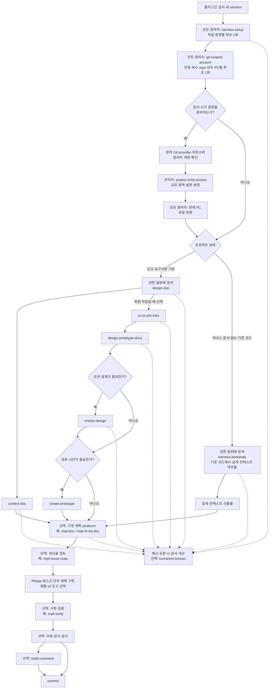
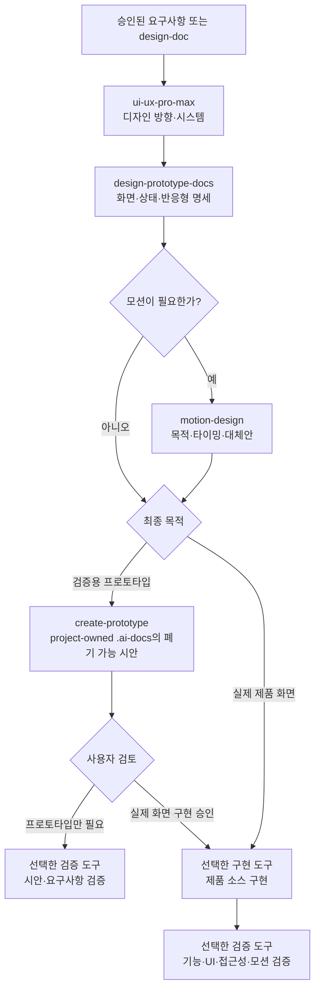

# Harness Kit — 관리 저장소

> 이 저장소는 하네스를 개발·검증·배포하는 **관리 저장소**다.
> 실제 프로젝트에서는 이 저장소를 clone하거나 스킬을 복사하지 않고, Codex 또는 Claude에 사용자용 `harness-kit` 플러그인을 설치해서 사용한다.

플러그인을 설치한 프로젝트 수행자는 `harness-setup`으로 `.ai-docs/**`와 `AGENTS.md`를 만든 뒤 설계·구현·검증 흐름을 수행한다.
관리자는 이 저장소에서 사용자 스킬, 외부 upstream, 플러그인 패키지를 유지한다.

## 문서 안내

현재 사용 방법과 운영 구조를 설명하는 정보 제공 문서만 정리한다.

| 문서 | 소개 |
|---|---|
| [Plugin Installation Guide](./.user-docs/Plugin_Installation_Guide.md) | Codex CLI·앱과 Claude Code CLI·앱의 설치·업데이트·제거 및 첫 호출 방법 |
| [Harness Engineering](./.user-docs/Harness_Engineering.md) | 플러그인 운영, `.ai-docs` 구조, 설계·구현·검증, 관리자 경계를 정의한 현행 정본 |
| [Multi App Document Flow and Ownership](./.user-docs/Multi_App_Doc_Flow_And_Ownership.md) | 복수 애플리케이션 프로젝트에서 AI가 문서를 읽고 만드는 흐름과 역할별 문서 소유권·쓰기 권한 기준 |
| [Harness Engineering Intro](./.user-docs/Harness_Engineering_Intro.md) | 하네스 도입 배경과 실제 프로젝트 사용 흐름을 처음 보는 사람을 위한 안내서 |
| [Skill Upstream Governance](./.user-docs/Skill_Upstream_Governance.md) | 외부 출처의 직접 반영·변형 반영·개념/행동 참조, provenance와 최신화 정책 |
| [maintainer/README.md](./maintainer/README.md) | 관리자 스킬, projection, 사용자 플러그인의 책임 경계와 유지보수 방법 |

현재 정본과 배포본:

- 사용자 스킬 정본: `skills/`의 20종. `project-write-access`를 포함한다.
- 현재 stable: [`harness-kit` `0.6.0`](https://github.com/hb9397/harness-kit/releases/tag/v0.6.0)
- stable archive: `plugins/harness-kit-0.6.0.zip` (`05254286fb1ed8266843230ae6839dbaeadd3088791adb660f17749204445a2f`)
- `0.6.0` Codex runtime: 20 skills / 0 agents
- `0.6.0` Claude runtime: 20 skills / 0 agents
- `project-write-access`는 `0.6.0` stable에 포함된다. 공유 정책 설정·변경은 관리자만 명시적으로 수행하고, 정책 생성 뒤의 PC별 로컬 등록은 각 참여자가 수행한다.
- 관리자 스킬: 3종, 이 저장소 안에서만 사용
- 게시된 최신 stable은 [`v0.6.0`](https://github.com/hb9397/harness-kit/releases/tag/v0.6.0)이다. annotated tag, GitHub Release와 원격 archive 검증 결과는 `maintainer/plugin/publish.json`에 보존한다.

### 함께 사용해볼 만한 플러그인

다음은 Harness Kit에 포함되지 않는 독립 외부 프로젝트다. 함께 설치할 때는 각 저장소의 설치 범위, hook·MCP·파일 변경, 권한과 보안 정책을 먼저 확인한다.

| 플러그인 | 함께 쓰는 목적 | GitHub |
|---|---|---|
| Caveman | 에이전트 응답을 짧고 압축된 형태로 유지 | [JuliusBrussee/caveman](https://github.com/JuliusBrussee/caveman) |
| Ponytail | 최소 변경 중심으로 불필요한 구현을 줄이는 작업 규칙 | [DietrichGebert/ponytail](https://github.com/DietrichGebert/ponytail) |
| Ruflo | 다중 에이전트 조정, swarm workflow와 orchestration이 필요한 작업 | [ruvnet/ruflo](https://github.com/ruvnet/ruflo) |
| Context7 | 구현·검증 단계에서 라이브러리·프레임워크 최신 공식 문서를 MCP로 조회 | [upstash/context7](https://github.com/upstash/context7) |

---

# 제1부. 사용자용 — 실제 프로젝트 수행

## 1. 플러그인 적용

### Codex

- CLI: `codex plugin marketplace add <이 저장소 URL 또는 루트 경로>` 후 `codex plugin add harness-kit@hb9397`
- Codex 앱: 왼쪽 메뉴의 **플러그인**에서 설정 아이콘을 누르고 **플러그인 마켓플레이스 추가**를 연다. GitHub 저장소 화면의 **Code → Local → HTTPS**에서 복사한 `.git` 포함 URL `https://github.com/hb9397/harness-kit.git`을 **출처**에 입력하고 `main` ref를 사용한다. 필요한 경우 sparse 경로를 지정한다. 앱에서 local marketplace 등록을 지원하지 않으면 같은 사용자 프로필의 CLI에서 등록한 뒤 앱을 재시작한다.
- 설치 후 새 task에서 `$harness-setup`처럼 `$skill-name`으로 명시 호출한다. ChatGPT Work의 `@` 호출과 혼동하지 않는다.
- IDE extension은 별도의 플러그인 설치 인터페이스로 보지 않는다. Codex CLI/앱 설치를 우선한다.


### Claude

- Claude Code CLI: `claude plugin marketplace add <이 저장소 URL·owner/repo 또는 ./로 시작하는 로컬 상대경로>` 후 `claude plugin install harness-kit@hb9397`
- 설치 후 대화형 session에서 `/reload-plugins`를 실행하고 `/harness-kit:harness-setup`처럼 namespaced skill을 명시 호출한다.
- Claude 앱: **설정 → 플러그인 → 추가 → 마켓플레이스 추가**에서 **URL**을 선택한다. GitHub 저장소 화면의 **Code → Local → HTTPS**에서 복사한 `.git` 포함 URL `https://github.com/hb9397/harness-kit.git`을 입력하고 동기화한다. 목록에 보이지 않으면 같은 사용자 프로필의 Claude Code CLI에서 marketplace를 등록한 뒤 앱을 다시 열어 설치하고 새 session을 연다.
- Claude Chat/Cowork는 Code 플러그인과 별도 인터페이스다. 설치·권한·cache는 별도로 검증한다.


### 사용자 스킬 정본 20종

`변형 반영(adapted)`은 외부 원본을 번역·재구성하거나 핵심 자료를 포함한 관계이고, `참조(reference)`는 개념·행동만 참고하며 외부 파일을 직접 포함하지 않는 관계다.

| 계열 | 스킬 정본 | 주 용도 | upstream 관계·출처 |
|---|---|---|---|
| 설치·기반 | [harness-setup](./skills/harness-setup/SKILL.md) | `.ai-docs`와 루트 컨텍스트 초기화·복구 | 참조: [OpenAI AGENTS.md](https://learn.chatgpt.com/docs/agent-configuration/agents-md), [Claude Code memory](https://code.claude.com/docs/en/memory) |
| 설치·기반 | [harness-bootstrap](./skills/harness-bootstrap/SKILL.md) | 기존 코드에서 설계·컨텍스트 역추출 | 참조: [OpenAI AGENTS.md](https://learn.chatgpt.com/docs/agent-configuration/agents-md), [Claude Code memory](https://code.claude.com/docs/en/memory) |
| 설치·기반 | [git-scoped-account](./skills/git-scoped-account/SKILL.md) | 단일·복수 repo의 Git 작성자와 provider·host·login을 프로젝트 범위로 연결 | 로컬 정본: [harness-kit](https://github.com/hb9397/harness-kit) |
| 권한 | [project-write-access](./skills/project-write-access/SKILL.md) | 공유 문서 역할 정책과 참여자 PC별 Git 훅·AI 쓰기 가드 등록 | 로컬 정본: [harness-kit](https://github.com/hb9397/harness-kit) |
| 설계·컨텍스트 | [design-doc](./skills/design-doc/SKILL.md) | 프로젝트 전체는 확장 가능한 앱 기준 문서로, 상세 단위는 구조화한 설계로 작성 | 참조: [Superpowers](https://github.com/obra/superpowers), [gstack](https://github.com/garrytan/gstack) |
| 설계·컨텍스트 | [context-doc](./skills/context-doc/SKILL.md) | DESIGN과 양방향 추적하는 앱별 1~10 컨텍스트와 주제별 instruction 생성 | 참조: [OpenAI AGENTS.md](https://learn.chatgpt.com/docs/agent-configuration/agents-md), [Claude Code memory](https://code.claude.com/docs/en/memory) |
| UI/UX 설계 | [ui-ux-pro-max](./skills/ui-ux-pro-max/SKILL.md) | 제품 유형·스타일·색·타이포그래피·레이아웃 결정 | 변형 반영: [UI/UX Pro Max](https://github.com/nextlevelbuilder/ui-ux-pro-max-skill) |
| 모션 설계 | [motion-design](./skills/motion-design/SKILL.md) | 모션 목적·타이밍·이징·접근성·성능 결정 | 변형 반영: [LottieFiles Motion Design](https://github.com/LottieFiles/motion-design-skill) |
| 프로토타입 | [design-prototype-docs](./skills/design-prototype-docs/SKILL.md) | 화면 설계 문서 생성 | 참조: [OpenAI Product Design](https://github.com/openai/role-specific-plugins/tree/main/plugins/product-design), [gstack](https://github.com/garrytan/gstack), [UI/UX Pro Max](https://github.com/nextlevelbuilder/ui-ux-pro-max-skill), [LottieFiles Motion Design](https://github.com/LottieFiles/motion-design-skill) |
| 프로토타입 | [create-prototype](./skills/create-prototype/SKILL.md) | HTML/CSS/JS 기반 검증 시안 생성 | 참조: [OpenAI Product Design](https://github.com/openai/role-specific-plugins/tree/main/plugins/product-design), [gstack](https://github.com/garrytan/gstack), [UI/UX Pro Max](https://github.com/nextlevelbuilder/ui-ux-pro-max-skill), [LottieFiles Motion Design](https://github.com/LottieFiles/motion-design-skill) |
| UI | [frontend-design](./skills/frontend-design/SKILL.md) | 실제 제품 UI 구현 품질 기준 | 변형 반영: [Anthropic frontend-design](https://github.com/anthropics/skills/tree/main/skills/frontend-design)<br>참조: [OpenAI Product Design](https://github.com/openai/role-specific-plugins/tree/main/plugins/product-design), [UI/UX Pro Max](https://github.com/nextlevelbuilder/ui-ux-pro-max-skill), [LottieFiles Motion Design](https://github.com/LottieFiles/motion-design-skill) |
| 구현 계획 | [impl-doc](./skills/impl-doc/SKILL.md) | 단일·소규모 기능 구현 계획 | 참조: [Superpowers](https://github.com/obra/superpowers), [gstack](https://github.com/garrytan/gstack) |
| 구현 계획 | [impl-fe-be-doc](./skills/impl-fe-be-doc/SKILL.md) | FE/BE 페어·다중 화면 구현 계획 | 참조: [Superpowers](https://github.com/obra/superpowers), [gstack](https://github.com/garrytan/gstack) |
| 구현 점검 | [impl-reuse-scan](./skills/impl-reuse-scan/SKILL.md) | 구현 전 재사용 후보 보고 | 참조: [Superpowers](https://github.com/obra/superpowers), [gstack](https://github.com/garrytan/gstack) |
| 구현 검증 | [impl-verify](./skills/impl-verify/SKILL.md) | Phase·태스크 검증 매트릭스 | 참조: [Superpowers](https://github.com/obra/superpowers), [gstack](https://github.com/garrytan/gstack), [UI/UX Pro Max](https://github.com/nextlevelbuilder/ui-ux-pro-max-skill), [LottieFiles Motion Design](https://github.com/LottieFiles/motion-design-skill) |
| 품질 | [multi-review](./skills/multi-review/SKILL.md) | 보안·성능·유지보수·테스트 리뷰 | 참조: [Superpowers](https://github.com/obra/superpowers), [gstack](https://github.com/garrytan/gstack) |
| 품질 | [commit](./skills/commit/SKILL.md) | 범위·diff·hook·Conventional Commit·사후 증거 확인 | 행동 참조: [Codex 기본 지침](https://github.com/openai/codex/blob/2cf2a6a844f1fc2ddd489c8a67fa8bc2f59a6f3d/codex-rs/protocol/src/prompts/base_instructions/default.md), [Claude Code commit](https://code.claude.com/docs/en/headless#create-a-commit), [Conventional Commits 1.0.0](https://www.conventionalcommits.org/en/v1.0.0/) |
| 품질 | [code-comment](./skills/code-comment/SKILL.md) | 필요한 변경 코드의 한글 주석 보강 | 로컬 정본: [harness-kit](https://github.com/hb9397/harness-kit) |
| 문서 | [doc-audit](./skills/doc-audit/SKILL.md) | 코드와 문서의 괴리 분석 | 참조: [OpenAI AGENTS.md](https://learn.chatgpt.com/docs/agent-configuration/agents-md), [Claude Code memory](https://code.claude.com/docs/en/memory) |
| 문서 | [humanize-korean](./skills/humanize-korean/SKILL.md) | Markdown 개선안·diff 제안 | 변형 반영: [im-not-ai](https://github.com/epoko77-ai/im-not-ai) |

## 2. 기본 작업 흐름 한눈에 보기

새 프로젝트, RFP 프로젝트, 문서 없는 기존 코드베이스는 진입점만 다르고 같은 구현·검증 흐름으로 합류한다.



### 0단계 — 환경 준비

1. Codex 또는 Claude에 플러그인을 설치하고 새 task/session을 연다.
2. 모든 참여자는 자기 작업 환경에서 `harness-setup`을 최초 1회 실행한다. 플러그인 공지가 하네스 갱신을 요구하거나 앱 경계가 바뀌거나 문서 골격을 복구할 때만 update mode로 다시 실행한다. 서명 권한 정책이 활성화된 뒤 공유 루트·하네스 파일을 실제로 갱신하는 주체는 `admin`이며, 다른 참여자는 갱신된 파일을 받은 뒤 자기 환경의 읽기·로컬 연결 상태만 확인한다.
3. 단일·복수 repo의 모든 참여자는 자기 PC에서 `git-scoped-account`를 최초 1회 명시 호출한다. `user.name`·`user.email`의 공통 config 출처와 저장소별 provider·host·login 표식을 확인한다. 새 PC·새 clone, 계정 변경이나 1단계 repo 추가 때 다시 실행한다.
4. 문서 쓰기 권한을 분리한다면 원격 Git provider와 저장소, 참여자 계정이 먼저 준비돼야 한다. 관리자는 `project-write-access`를 명시 호출해 공유 정책을 설정한다. `harness-setup`과 Git 계정 등록을 마친 뒤, `design-doc`, `context-doc`, 앱 핵심 문서를 만드는 `harness-bootstrap`보다 먼저 수행한다.
5. 공유 정책이 생긴 뒤에는 각 참여자가 자기 PC에서 `git-scoped-account`의 로컬 등록 분기를 수행한다. 이 단계는 관리자 키 없이 현재 clone의 Git 훅과 AI 쓰기 가드만 연결하며 공유 정책·CODEOWNERS·원격 설정은 바꾸지 않는다.
6. 생성·갱신 범위가 `.ai-docs/**`, 루트 `AGENTS.md`뿐인지 확인한다. Claude를 함께 쓸 때는 프로젝트부터 파일시스템 루트까지 `CLAUDE.md`, `.claude/CLAUDE.md`, `CLAUDE.local.md`가 없어야 한다.
7. `harness-setup`이 플러그인의 사용자 스킬 복사본을 `.agents/skills/`, `.claude/skills/`, `skills/`에 만들지 않았는지 확인한다.

`harness-setup`은 플러그인을 설치하는 스킬이 아니다. 설치된 플러그인을 사용해 프로젝트 문서 골격과 루트 컨텍스트를 만드는 스킬이다.

공유되는 `.ai-docs/**`, 루트 컨텍스트와 host managed 설정에는 사용자 홈이나 checkout
절대경로를 기록하지 않는다. routing의 프로젝트 루트는 `.`이고, PC별 설치·신뢰 상태는
Git에서 제외되는 `.ai-docs/.harness/routing-state.local.json`에 둔다. 기존 하네스는
업데이트된 `harness-setup`을 다시 실행하면 이 portable 형식으로 갱신된다.

`.ai-docs/_inbox/`의 참고 파일은 기본적으로 `.gitignore`에 따라 로컬에서만 보관한다.
다만 설계·instruction에 계속 참고해야 하는 원문을 팀과 공유하려면 사용자가 정확한
파일 경로와 Git 공유 의도를 명시적으로 요청한 경우에만 해당 파일을 선택 추적할 수 있다.
선택 추적 전에는 민감정보·저작권·저장소 용량을 확인하고 `_inbox/` 전체를 강제 추가하지
않는다. 추적된 원문은 clone/pull에 포함되지만 정규 산출물로 승격된 것은 아니며, commit과
원격 push는 각각 별도의 명시적 요청이 있어야 한다.

`project-write-access`는 선택 기능이며 권한 관리만 담당한다. 정책을 사용하지 않아도 기존 하네스 흐름은 그대로 작동한다. `admin`은 하네스·루트 지도·권한 정책만 관리하고 앱 문서 권한을 상속하지 않는다. `pm-pl`은 모든 앱, `app-doc-lead`는 배정된 앱에서 `design-doc`과 `context-doc`을 사용할 수 있다. 앱 핵심 문서를 AI로 쓰기 직전에는 권한자에게도 문서의 역할·대상·변경 이유를 설명하고 한 번 더 확인한다. `developer`는 일반 기여자를 명시하는 역할이며, 등록 여부와 무관하게 기존 저장소 권한으로 구현 계획·프로토타입·`_inbox` 같은 `team` 범위와 앱 소스코드를 사용한다. 정책이 있는데 현재 PC의 `git-scoped-account` 또는 로컬 등록이 없거나 계정이 다르면 지원되는 AI 가드는 `.ai-docs/**` 쓰기를 거부한다. 이는 애플리케이션 소스코드 권한을 바꾸지 않는다.

### 1단계 — 설계·컨텍스트·프로토타입

- 아이디어나 요구사항이 있으면 `design-doc`으로 설계한다. 프로젝트 전체 `DESIGN.md`는
  개요·상위 기능 분류·기술 스택·아키텍처·앱 특이사항·배포 환경·VSCode 추천을 담되,
  상위 기능 분류에 없는 상세 문서나 구현을 막는 허용 목록으로 사용하지 않는다.
  본문에는 변경 이력을 누적하지 않고 현재 기준 사실만 남긴다.
- RFP가 있으면 파일이나 필요한 요구사항을 `design-doc`, `design-prototype-docs`, 다중 화면·FE/BE 페어 계획용 `impl-fe-be-doc` 요청에 직접 제공한다. 단일·소규모 구현 계획에는 승인된 설계나 PRD를 `impl-doc` 입력값으로 사용한다.
- 문서가 없는 기존 코드베이스에는 `harness-bootstrap`을 사용한다. 이 스킬은 필요한 `harness-setup` 골격을 확인한 뒤 코드에서 설계와 컨텍스트를 역추출한다.
- 설계가 정리되면 `context-doc`으로 DESIGN과 양방향 추적하는 앱별 1~10 컨텍스트와
  주제별 instruction 문서를 만든다. 앱 컨텍스트에는 개요·기술 스택·아키텍처·실행
  프로필·Git·배포·계층형 앱 특이사항·환경 변수·AI 구현 지침·구축 대상 기능 분류를
  현재 사실로 유지한다. 핵심 도메인 개념은 앱 특이사항의 하위 노드에 두고, 10번 기능
  분류는 DESIGN.md 02와 같은 노드·Depth로 추적한다. 최상단에서는
  루트 컨텍스트 → 앱 컨텍스트 → 작업 관련 instruction 필독 순서를 안내한다. 루트 읽기 지도
  갱신이 필요하면 `admin`이 `harness-setup`을 다시 실행한다. 최초 instruction은 공통
  주제의 목적만 설명하는 빈 골격으로 시작하고, 이후 확정된 현재 규칙으로 갱신한다.
  더 이상 적용 근거가 없는 선택 파일은 승인 후 9번 인덱스와 함께 제거한다. 앱 context와
  instruction 본문에는 과거 값이나 변경 이력을 남기지 않는다.
- 화면 작업이면 `ui-ux-pro-max`로 디자인 방향을 정한 뒤 `design-prototype-docs`로 화면 설계 문서를 만든다.
- 모션이 필요하면 `motion-design`으로 목적·타이밍·reduced-motion 대안을 정한다. 검증 시안은 `create-prototype`으로 만든다.

`design-doc`은 초안을 대화창에 보여 주고 사용자가 저장을 승인하면 파일로 저장한다.
프로젝트 전체에서는 기술 스택을 근거로 아키텍처 권장안·대안과 패키지·파일 구조
예시를 먼저 보여주고 선택받는다. 후속 스킬에 파일 경로를 넘길 계획이라면 저장까지 요청한다.

권한 정책이 활성화된 프로젝트에서는 서명 정책과 쓰기 가드가 현재 Git 계정, 역할, 대상 앱을 먼저 판정한다. `design-doc`과 `context-doc`은 역할을 부여하거나 권한 정책을 바꾸지 않는다.

### 2단계 — 선택형 구현 계획과 재사용 점검

| 상황 | 선택 |
|------|------|
| 한 앱의 단일 BE 기능, 단일 FE 기능, 모듈, CLI, 배치, 스크립트, 라이브러리 | `impl-doc` |
| FE/BE 페어 다중 기능, 다중 화면, RFP/SFR 화면 중심 작업 | `impl-fe-be-doc` |

`impl-doc`과 `impl-fe-be-doc`은 Harness Kit가 제공하는 구현 계획 선택지다. 다른 설치
스킬·플러그인·일반 Agent로 계획을 만들어도 동일한 정규 경로·roadmap index·owner·승인·
evidence 계약을 따른다. 재사용 검토에는 `impl-reuse-scan`, 완료 검증에는 `impl-verify`를
선택할 수 있지만 특정 이름의 호출은 필수가 아니다. 어떤 도구를 쓰더라도 재사용 후보는
사용자 결정 전에 자동 반영하지 않고 실행하지 못한 검증은 통과로 기록하지 않는다.

### 3단계 — 구현과 검증

1. 구현 계획에서 이번 턴의 Phase 또는 태스크 하나를 고른다.
2. 참조 문서, 수정 허용 파일, 금지 범위, 완료 기준을 함께 제시한다.
3. UI 비중이 높은 실제 제품 코드는 선택한 제품 구현 도구로 승인된 앱 source에 반영한다.
4. 구현이 끝나면 선택한 검증 도구로 계획 대비 결과와 evidence를 남긴다.
5. 실패가 있으면 해당 Phase를 보완하고 다시 검증한다.

모든 Markdown producer는 단일 앱의 `@.ai-docs/instruction/artifact-output-routing-instruction.md` 또는 복수 앱의 `@.ai-docs/{앱}/instruction/artifact-output-routing-instruction.md`를 기준으로 산출물 위치·소유권·인계를 결정한다. `create-prototype`은 같은 계약에 따라 `.ai-docs/prototype/**` 또는 `.ai-docs/{앱}/prototype/**`에 폐기 가능한 검증 시안을 만들고 `frontend-design`은 승인된 앱 소스에 실제 제품 UI를 구현한다.

### 4단계 — 품질·문서·커밋

1. 필요하면 `multi-review` 또는 동등한 도구로 보안·성능·유지보수·테스트 관점을 점검한다.
2. 필요하면 `doc-audit` 또는 동등한 방식으로 코드와 `.ai-docs`, `AGENTS.md`의 괴리를 찾는다.
3. 필요한 문서 변경은 제안을 검토하고 승인한 뒤 반영한다.
4. 인수인계에 필요한 주석이 부족할 때만 `code-comment`를 사용한다.
5. 파일이 바뀐 최종 상태에서 프로젝트 검증을 다시 실행하고 증거를 남긴다.
6. 사용자가 `commit`을 명시 호출하면 스킬이 지침, status, staged·unstaged·untracked 범위, diff와 최근 log를 확인하고 의도한 파일만 stage한다.
7. 정상 hook을 통과해 Conventional Commit을 만든 뒤 SHA, `git show`, status와 남은 변경을 다시 확인한다. 자동 push·amend·tag·branch 생성은 하지 않는다.

사용자가 Markdown 문체 개선을 명시적으로 요청하면 원 producer가 구조를 검증한 뒤
`humanize-korean` 개선안과 diff를 한 번 제안할 수 있다. 요청이 없으면 제안하지 않는다.
승인한 변경만 반영하고 원 producer가 다시 검증한다.

## 3. Markdown 산출물과 문서 개선

여기서 producer는 Markdown 파일이나 문서 묶음을 생성·갱신하고 저장 경로와 필수 구조,
링크, index, bridge를 검증한 뒤 다음 단계로 인계하는 산출물 책임 주체를 뜻한다. 아래는
Harness Kit가 제공하는 Markdown producer 9종이며 독점 실행 목록이 아니다.

고정 producer 7종:

- `harness-setup`
- `harness-bootstrap`
- `design-doc`
- `context-doc`
- `design-prototype-docs`
- `impl-doc`
- `impl-fe-be-doc`

조건부 producer 2종:

- `ui-ux-pro-max`
- `motion-design`

조건부 2종은 기본적으로 대화창에 결과를 보고한다. 사용자가 디자인 시스템이나 모션
명세의 저장을 명시적으로 요청했을 때만 파일을 만든다. 문체 개선도 사용자가 명시 요청한
경우에만 원 producer가 먼저 구조를 검증하고 bundle의 최외곽 owner가
`humanize-korean` 개선안과 diff를 한 번 제안한다.

사용자가 승인한 변경만 반영하며, 링크·경로·코드블록·표·식별자 같은 보호 요소를 보존한다. 반영 뒤에는 원 producer가 링크·index·bridge·문서 구조를 다시 검증한다. 제안·건너뛰기·거절·적용 상태와 내용 fingerprint는 `.ai-docs/.harness/humanize-handoffs.json`에 기록해 같은 내용의 중복 제안을 막는다. 문서 개선을 건너뛰어도 원래 하네스 흐름은 계속된다.

## 4. 최초 실행과 갱신 시점

| 항목 | 최초 | 다시 실행할 때 |
|------|------|----------------|
| 플러그인 설치 | 사용자 프로필에 설치 | 새 릴리스 적용 시 plugin update 후 새 session |
| `harness-setup` | 모든 참여자가 자기 작업 환경에서 1회 | 정책이 없으면 필요한 참여자가 갱신하고, 서명 정책 활성 뒤 공유 루트·하네스 갱신은 `admin`이 수행 |
| Git 작성자·provider 계정 | 단일·복수 repo의 모든 참여자가 `git-scoped-account` 1회 | 새 PC·새 clone, 계정 변경 또는 컨테이너 바로 아래 repo 추가 때 |
| `project-write-access` 공유 정책 | 권한 분리가 필요할 때 검증된 관리자가 설정 | 관리자·계정·역할·앱 배정·경로가 바뀔 때 |
| 권한 정책의 PC별 로컬 등록 | 공유 정책 생성 뒤 각 참여자가 자기 PC에서 수행 | 새 PC·새 clone 또는 로컬 Git·AI 가드 연결이 바뀔 때 |
| `design-doc` | 권한 정책이 있으면 허용된 역할이 확장 가능한 앱별 설계 정본 작성 | 상위 기능 분류·기술 스택·아키텍처·앱 고유 사실이 바뀔 때 |
| `harness-bootstrap` | 문서 없는 기존 코드에 최초 도입 | 전체 재스캔보다 `design-doc`·`context-doc` 갱신을 우선 |
| `context-doc` | 권한 정책이 있으면 `design-doc`과 같은 역할·앱 범위에서 실행 | DESIGN 또는 기술·아키텍처·실행 프로필·Git·배포·환경 변수·구현 지침의 현재 사실이 바뀔 때 |
| `impl-*` | 기능 구현 전에 작성 | 범위·Phase·의존성·완료 기준이 바뀔 때 |
| `doc-audit` | 필요 시 | 코드와 문서가 어긋났거나 릴리스 전일 때 |

플러그인 업데이트는 사용자 스킬을 갱신하지만, 프로젝트 `.ai-docs`를 자동으로 덮어쓰지는 않는다. 프로젝트 문서 갱신은 해당 producer의 승인 흐름으로 수행한다.

## 5. 단일/복수 앱과 `.ai-docs`

새 하네스의 문서 루트는 `.ai-docs/` 하나뿐이다. `.docs/` 디렉토리가 존재해도 참조하지 않고 일반 디렉토리로 취급한다.

### 단일 애플리케이션

앱 repo 안에서 코드와 하네스 산출물을 함께 관리한다.

```text
my-app/
├── .ai-docs/
│   ├── context-base/
│   ├── instruction/
│   ├── impl-doc/
│   ├── prototype/
│   └── .harness/
├── AGENTS.md            ← 공용 컨텍스트 정본
└── src/
```

### 복수 애플리케이션

프로젝트 최상위 폴더는 보통 git으로 관리하지 않고 앱 repo와 공용 `.ai-docs` repo를 분리한다.

```text
my-project/
├── app-frontend/        ← 별도 git repo
├── app-backend/         ← 별도 git repo
├── .ai-docs/            ← 별도 git repo 권장
│   ├── app-frontend/
│   ├── app-backend/
│   └── root-context/
└── AGENTS.md            ← 실행용
```

복수 앱 구성에서는 루트 폴더를 보통 git으로 관리하지 않으므로, `.ai-docs/root-context/AGENTS.md`가 루트 정본 내용을 형상관리하는 실제 원본 역할을 한다. 실행용 루트 `AGENTS.md`는 `harness-setup`이 이 관리 원본을 기준으로 갱신한다. 이미 별도 `.ai-docs` repo를 운영하고 있다면 먼저 올바른 위치에 clone/pull한 뒤 `harness-setup`을 실행해 기존 문서를 기준으로 갱신한다. Claude Code는 2.1.277 이상에서 `AGENTS.md`를 직접 읽으며, 선점하는 Claude instruction 파일이 있으면 setup이 중단된다.

## 6. 주요 산출물과 형상관리

| 산출물 | 기본 위치 | 관리 기준 |
|--------|-----------|-----------|
| 설계 문서 | 단일 `.ai-docs/context-base/DESIGN.md`, 복수 `.ai-docs/{앱}/context-base/DESIGN.md` | 프로젝트 문서로 commit |
| 에이전트 규칙 | `AGENTS.md`, `.ai-docs/**/instruction/` | `AGENTS.md` 단일 정본 |
| 화면 설계 | 단일 `.ai-docs/prototype/{사용자}/{식별자}/design-doc.md`, 복수 `.ai-docs/{앱}/prototype/{사용자}/{식별자}/design-doc.md` | 프로젝트 문서로 commit |
| 프로토타입 | 단일 `.ai-docs/prototype/{사용자}/{식별자}/`, 복수 `.ai-docs/{앱}/prototype/{사용자}/{식별자}/` | 검증용 산출물, 프로젝트 정책에 따라 commit |
| 디자인 시스템 | 단일 `.ai-docs/design-system/{project-slug}/MASTER.md`·`pages/{page-slug}.md`, 복수 `.ai-docs/{앱}/design-system/{project-slug}/MASTER.md`·`pages/{page-slug}.md` | `ui-ux-pro-max` 산출물, 명시적 저장 요청 시 프로젝트 정책에 따라 commit |
| 모션 명세 | 단일 `.ai-docs/design-system/{project-slug}/motion/{screen-or-component}.md`, 복수 `.ai-docs/{앱}/design-system/{project-slug}/motion/{screen-or-component}.md` | `motion-design` 산출물, 명시적 저장 요청 시 프로젝트 정책에 따라 commit |
| 구현 계획 | 단일 `.ai-docs/impl-doc/{사용자}/`, 복수 `.ai-docs/{앱}/impl-doc/{사용자}/` | 계획서와 공용 roadmap index를 함께 관리 |
| 문서 개선 ledger | `.ai-docs/.harness/humanize-handoffs.json` | 최종 Markdown fingerprint와 결정 상태 관리 |
| 사용자 스킬 | 설치된 `harness-kit` 플러그인 | 프로젝트에 복사하지 않음 |

`impl-doc`과 `impl-fe-be-doc`은 같은 저장소와 `{YYMMDD}-0.{앱이름}-roadmap-impl-index.md`를 공유한다. 생성 스킬은 문서 머리말로 구분한다.

## 6-1. 디자인 작업 흐름

화면이 있는 작업에서 선택하는 별도 흐름이다. §2의 일반 흐름을 대체하지 않고, UI 판단이 필요할 때만 그 안에서 갈라져 나온다. 백엔드 전용 작업이나 화면 명세가 이미 확정된 단순 구현에는 쓰지 않는다.



두 갈래의 차이는 **산출물의 수명**이다.

| | 프로토타입 분기 | 실제 화면 분기 |
|---|---|---|
| 산출물 | 단일 `.ai-docs/prototype/**` 또는 복수 `.ai-docs/{앱}/prototype/**` 아래 HTML·CSS·JS | 제품 소스코드 |
| 목적 | 요구사항·UX 검증 | 유지보수되는 제품 화면 |
| 수명 | 검증이 끝나면 폐기 가능 | 계속 유지 |

**프로토타입 코드는 제품 소스로 복사하지 않는다.** 승인 후 실제 구현으로 넘어갈 때는 승인된 디자인 결정과 화면 명세만 전달하고, 선택한 제품 구현 도구가 기존 컴포넌트·토큰·프레임워크에 맞게 다시 구현한다. `frontend-design`은 제공 선택지이며 다른 설치 스킬·플러그인·일반 Agent도 같은 계약을 따르면 된다. 처음부터 실제 화면을 요청하면 프로토타입 단계를 강제하지 않는다.

모션은 조건부다. 정적 화면으로 목적이 충분하거나 요구사항에 모션이 없으면 `motion-design`을 건너뛴다. 공공·의료·금융·엔터프라이즈 화면은 낮은 모션 밀도가 기본값이다.

### 디자인·모션 스킬 호출 예시

```text
$ui-ux-pro-max
기존 React 관리자 화면의 디자인 시스템을 제안해줘.
현재 토큰이 있으면 우선하고 파일은 아직 만들지 마.
```

```text
/harness-kit:motion-design
이 결제 버튼의 loading → success → error 전환을 설계해줘.
reduced-motion 대체안과 성능 검증 기준도 포함해줘.
```

두 스킬 모두 기본은 대화창 보고다. 사용자가 명시적으로 저장을 요청할 때만 다음 위치에 파일을 만든다.

| 담당 스킬 | 단일 앱 | 복수 앱 |
|---|---|---|
| `ui-ux-pro-max` | `.ai-docs/design-system/{project-slug}/MASTER.md`, `.ai-docs/design-system/{project-slug}/pages/{page-slug}.md` | `.ai-docs/{앱}/design-system/{project-slug}/MASTER.md`, `.ai-docs/{앱}/design-system/{project-slug}/pages/{page-slug}.md` |
| `motion-design` | `.ai-docs/design-system/{project-slug}/motion/{screen-or-component}.md` | `.ai-docs/{앱}/design-system/{project-slug}/motion/{screen-or-component}.md` |

## 7. 프로젝트 내부 사용자 스킬 복사본 처리

프로젝트에서는 사용자 스킬을 설치된 플러그인에서만 사용한다. `.agents/skills`, `.claude/skills` 또는 `skills/*/SKILL.md`에 사용자 스킬 복사본이 발견돼도 바로 삭제하지 않는다.

1. 사용자 플러그인을 설치한다.
2. 프로젝트 내부 사용자 스킬 복사본을 읽기 전용으로 inventory한다.
3. 플러그인 스킬 복사본, 사용자 수정 복사본, 프로젝트 custom skill을 분류한다.
4. 백업 위치와 복원 방법을 확인한다.
5. 사용자가 승인한 항목만 backup/remove 한다.
6. 새 session에서 플러그인 스킬만 한 번 노출되는지 확인한다.

산출물·스크립트·템플릿을 가진 스킬은 삭제·이동·교체 전에 반드시 확인한다.

---

# 제2부. 관리자용 — 하네스 개발·배포

## 8. 정본과 책임 경계

| 영역 | 정본 또는 산출물 | 사용 주체 |
|------|------------------|-----------|
| 사용자 스킬 | `skills/` | 하네스 관리자 |
| 관리자 스킬 | `maintainer/skills/` | 하네스 관리자 |
| 외부 upstream·provenance | `maintainer/upstreams/` | 하네스 관리자 |
| inventory·plugin metadata | `maintainer/inventory/`, `maintainer/plugin/` | 하네스 관리자 |
| 관리자 projection | `.agents/skills/`, `.claude/skills/` | repo-local 생성물 |
| 사용자 플러그인 후보 | `plugins/harness-kit/` | 빌드·검증 산출물 |
| 실제 프로젝트 | `.ai-docs/**`, `AGENTS.md`, 코드 | 프로젝트 수행자 |

별도의 관리자용 플러그인은 만들지 않는다. 관리자는 `maintainer/skills/`의 정본을 관리하고, 이 저장소의 로컬 관리자 동기화본(projection)으로 작업 환경을 유지한다. 사용자 경험을 검증할 때는 일반 사용자와 같은 조건에서 `harness-kit` 플러그인을 분리된 Codex·Claude CLI·앱 설정에 설치해 직접 사용해 본다.

관리자 동기화본(projection)은 직접 편집하지 않고 다음 생성기로만 정본과 맞춘다.

```bash
python maintainer/skills/harness-plugin-maintainer/scripts/sync_manager_projections.py
python maintainer/skills/harness-plugin-maintainer/scripts/sync_manager_projections.py --check
```

## 9. 관리자 스킬 3종

| 스킬 | 역할 |
|------|------|
| `custom-skill-design` | Anthropic `skill-creator`를 `adapted` 원본으로, OpenAI Codex 공식 `skill-creator`를 직접 `reference`로 사용해 스킬을 설계·생성·검증. portfolio provenance는 선택한 Superpowers 스킬 작성 원칙도 별도 `reference`로 추적 |
| `skill-portfolio-maintainer` | 외부 공식·유명 스킬 후보 탐색, integration mode 분류, provenance와 보호 자산 영향 관리 |
| `harness-plugin-maintainer` | 사용자 플러그인 build, validate, 설치 인터페이스 증적, release gate 관리 |

관리자 스킬은 사용자 플러그인 payload에 포함하지 않는다.

## 10. 외부 스킬과 upstream 관리

외부 관계는 다음 integration mode로 구분한다.

- `native`: 외부 upstream 관계가 없는 로컬 스킬
- `reference`: 원칙·아이디어·workflow만 참고하고 원문 자산은 배포하지 않음 — [개념·행동 참조 관계](./.user-docs/Skill_Upstream_Governance.md#concept-behavior-references)
- `adapted`: upstream 콘텐츠를 번역·수정·재구성해 사용함 — [직접 반입·변형 provenance](./.user-docs/Skill_Upstream_Governance.md#direct-import-provenance)
- `vendored`: upstream 파일을 원문 그대로 포함함 — [직접 반입·변형 provenance](./.user-docs/Skill_Upstream_Governance.md#direct-import-provenance)

증거가 부족하면 `unknown` 차단 상태로 두며, 해소 전에는 반입하거나 릴리스하지 않는다.

`commit`은 특정 외부 commit skill을 반입하지 않는다. OpenAI Codex·Anthropic Claude Code의 공식 행동 출처와 Conventional Commits를 behavior-only source로 두고 [commit-workflow 행동 계약](./.user-docs/Skill_Upstream_Governance.md#behavior-contracts)을 거쳐 소비한다.

관리자는 하나의 `skill-portfolio-maintainer` workflow에서 후보 탐색, 최신 upstream 비교, 영향 분석, 승인된 promotion handoff를 수행한다. mode마다 검토·반영·라이선스·동등성 검증 기준이 다르다. 현재 활성 `vendored` 관계는 없으며, 외부 runtime을 그대로 제공한다고 주장하지 않는다. 보호 자산의 삭제·이동·교체는 자동화하지 않는다.

`humanize-korean`은 `epoko77-ai/im-not-ai`의 주요 아이디어와 일부 자산을 번역·수정·재구성해 하네스의 승인형 문서 후처리로 반영한 `adapted` 사용자 스킬이다. 전체 upstream runtime을 그대로 `vendored`하지 않는다. 사용자는 별도 upstream clone 없이 플러그인 안에서 사용하고, 관리자가 GitHub upstream을 추적한다.

### 같은 저장소를 두 방식으로 추적하기

`ui-ux-pro-max`와 `motion-design`은 각 upstream을 **두 관계로 동시에** 추적한다.

| 구분 | 하는 일 | 플러그인 포함 |
|---|---|---|
| 직접 반입 `adapted` | 독립 스킬과 실행·지식 자산을 제공 | 포함 |
| 참고 `reference` | 기존 디자인·검증 스킬에 개념만 반영 | 미포함 |

두 관계는 같은 저장소 URL, 같은 라이선스 판정, 같은 고정 commit을 공유해야 하며 한쪽만 승격할 수 없다. 참고 관계는 파일을 복사하지 않으므로 라이선스 배포 대상이 아니다.

### 별도 설치 대상

다음 프로젝트는 이 플러그인에 포함하지 않는다. 필요하면 사용자가 원본 안내에 따라 직접 설치한다. 이 하네스의 필수 의존성이 아니다.

- [Caveman](https://github.com/JuliusBrussee/caveman) — 응답 표현과 토큰 사용 방식을 바꾸는 별도 플러그인이다. 하네스의 설계·검증 계약과 목적이 다르다.
- [Ruflo](https://github.com/ruvnet/ruflo) — 다중 에이전트, 메모리, MCP, hook을 포함하는 독립 메타 하네스다. 일부만 복제하지 않고 원본 제품으로 쓴다.

설치 방법은 바뀔 수 있으므로 여기에 명령을 복제하지 않는다. **최신 설치 방법은 각 원본 저장소의 안내를 따른다.**

세부 업데이트 기준은 [Skill Upstream Governance](./.user-docs/Skill_Upstream_Governance.md#approval-gates)를 따른다.

## 11. 플러그인 빌드와 릴리스

```text
skills/ 사용자 정본 수정
→ 관련 inventory·upstream registry·lock·provenance 갱신
→ harness-plugin-maintainer build
→ source/runtime/archive 검증
→ 격리된 Codex·Claude CLI 설치 점검
→ Codex·Claude CLI·앱 실제 모델 호출 수동 증적
→ release checklist
→ 별도 승인 후 tag/push/release
```

설치 점검은 실제 모델 호출 성공을 뜻하지 않는다. 네 인터페이스의 설치·명시 호출·산출물·재시작·새 session 증적이 부족하면 릴리스 후보는 `not-release-ready`로 유지한다.

대표 검증 명령:

```text
python maintainer/skills/harness-plugin-maintainer/scripts/build_plugin.py --check
python maintainer/skills/harness-plugin-maintainer/scripts/validate_plugin.py
python maintainer/skills/harness-plugin-maintainer/scripts/smoke_cli_install.py
python maintainer/skills/harness-plugin-maintainer/scripts/verify_install_surfaces.py --check
python skills/harness-setup/evals/run_evals.py
python maintainer/skills/harness-plugin-maintainer/scripts/sync_manager_projections.py --check
python maintainer/skills/skill-portfolio-maintainer/scripts/validate_registry.py
```

현재 릴리스 게이트는 [Plugin Release Checklist](./maintainer/plugin/release-checklist.md)에서 관리한다.

## 12. 상세 문서

- [Plugin Installation Guide](./.user-docs/Plugin_Installation_Guide.md) — Codex·Claude CLI/App 설치·업데이트·제거·수동 증적
- [Harness Engineering](./.user-docs/Harness_Engineering.md) — 사용자 런북과 관리자 운영 계약
- [Harness Engineering Intro](./.user-docs/Harness_Engineering_Intro.md) — 도입 배경, 선택 가이드, 프롬프트 예시
- [Docs Index](./.user-docs/README.md) — 문서 역할 인덱스
- [Skill Upstream Governance](./.user-docs/Skill_Upstream_Governance.md) — 외부 `reference`·`adapted`·`vendored` 관계, 행동 contract, provenance와 최신화 정책

## 13. 라이선스

이 저장소가 직접 저작한 부분은 Apache License 2.0을 따른다. 전문은 [LICENSE](./LICENSE)에 있고 저작권 표기는 [NOTICE](./NOTICE)에 있다.

외부에서 반입한 구성요소는 각자의 원 라이선스를 그대로 유지한다. 원본 출처, 고정 revision, 라이선스, 로컬 변경 여부는 [THIRD_PARTY_NOTICES.md](./THIRD_PARTY_NOTICES.md)에서 추적한다. 사용자 플러그인 아카이브는 독립 배포 단위이므로 라이선스 전문과 서드파티 고지를 자체적으로 포함한다.

`reference` 관계로만 참고한 외부 프로젝트는 파일을 반입하지 않으므로 라이선스 배포 대상이 아니다. 해당 관계는 [개념·행동 참조 관계](./.user-docs/Skill_Upstream_Governance.md#concept-behavior-references)에서 추적한다.

---

하네스의 핵심은 단순하다. **사용자는 플러그인으로 같은 작업 흐름을 실행하고, 관리자는 이 저장소에서 그 흐름의 스킬·외부 근거·배포 품질을 책임진다.**
